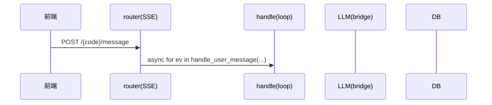

# A#1 练习：handle_user_message 三条路径时序图

> 阶段三② agent loop 的时序练习。补全下面三张 Mermaid 序列图的 `%% TODO` 处，
> 画完对着 `backend/app/services/chat_service.py` 的 `handle_user_message` 核对。
>
> 预览：VS Code 装扩展 "Markdown Preview Mermaid Support"；或把 mermaid 块贴到 https://mermaid.live 。
>
> 画的时候留意几个要点（体现对 loop 的理解）：
> - 每轮 `H->>LLM` = 一次 `_call_llm_with_retry(messages, TOOLS_SCHEMA)`；
> - search 那步用 `Note over H` 标「回喂 messages、**不落库、不吐 delta**」；
> - `H-->>R` 用 `yield` 体现「边跑边流式发事件」；delta 是逐字气泡，completed/error 是收尾；
> - 「结构化输出 ↔ agent loop」的分界线：`if is_executable_tool(...)` —— 想清楚它把 search 变成了「中间步骤」，而 ask/conclude 是「终点」。

---

## 路径一：直接 conclude（1 次 LLM，最短）

---

## 路径二：search → conclude（2 次 LLM）

---

## 路径三：一直 search → 触 MAX_AGENT_STEPS 兜底

---

## 附：mermaid 序列图常用语法速查

- 箭头：`A->>B: 实线（调用）` ／ `A-->>B: 虚线（返回/yield）`
- 备注：`Note over H: 文字` ／ `Note right of H: 文字`
- 循环：`loop 每轮` … `end`
- 可选/分支：`alt 条件` … `else` … `end`
- 自调用：`H->>H: 内部动作`（如 _execute_tool、回喂 messages）
